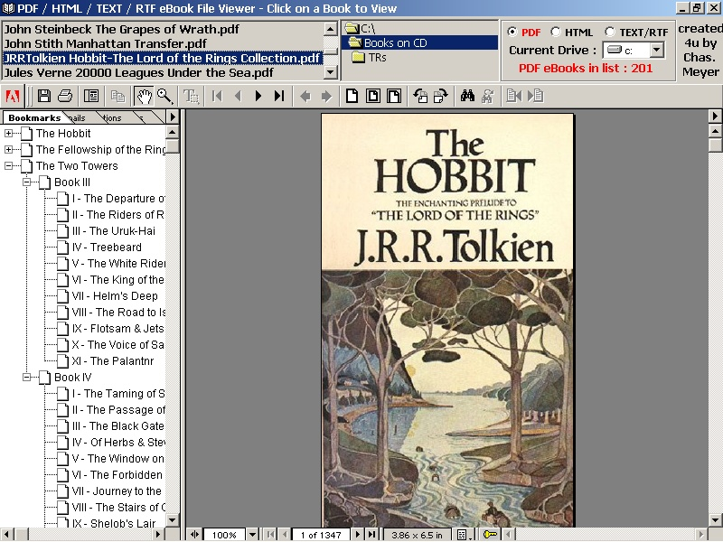



## BooksOnCD

### Description

i have alot of ebooks/manuals in pdf, html, rtf/txt form and it was a huge hassle to go thru the steps of opening the next file so, i put this together, you can have one of each file type loaded at same time. hope some of you find this helpful, add these components to project: Acrobat Control for ActiveX - pdf.ocx, comes with adobe reader in the reader\activex dir., the pdf.ocx is not supported by adobe, works with inet explorer and no doc avail. so you still need to have adobe reader loaded....but it's free too.

Microsoft Internet Controls - shdocvw.dll - vb6
 
### More Info
 
best if run at 1024x768, but 800x600 ok

much easier to read ebook files

             |
---                |---
**Submitted On**   |2001-11-29 16:54:38
**By**             |[Chasman](https://github.com/Planet-Source-Code/PSCIndex/blob/master/ByAuthor/chasman.md)
**Level**          |Intermediate
**User Rating**    |4.8 (62 globes from 13 users)
**Compatibility**  |VB 6\.0
**Category**       |[Complete Applications](https://github.com/Planet-Source-Code/PSCIndex/blob/master/ByCategory/complete-applications__1-27.md)
**World**          |[Visual Basic](https://github.com/Planet-Source-Code/PSCIndex/blob/master/ByWorld/visual-basic.md)
**Archive File**   |[BooksOnCD3839011292001\.zip](https://github.com/Planet-Source-Code/chasman-booksoncd__1-29333/archive/master.zip)

### API Declarations

all in zip file

